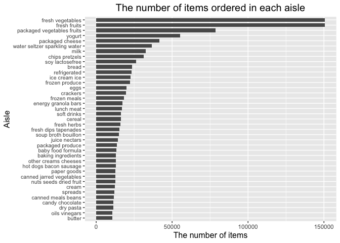

p8105_hw3_wb2366
================

``` r
library(tidyverse)
```

    ## ── Attaching packages ─────────────────────────────────────── tidyverse 1.3.1 ──

    ## ✓ ggplot2 3.3.5     ✓ purrr   0.3.4
    ## ✓ tibble  3.1.4     ✓ dplyr   1.0.7
    ## ✓ tidyr   1.1.3     ✓ stringr 1.4.0
    ## ✓ readr   2.0.1     ✓ forcats 0.5.1

    ## ── Conflicts ────────────────────────────────────────── tidyverse_conflicts() ──
    ## x dplyr::filter() masks stats::filter()
    ## x dplyr::lag()    masks stats::lag()

``` r
library(ggplot2)
```

## Problem1

**Load the data**

``` r
library(p8105.datasets)
data("instacart")
```

**How many aisles are there, and which aisles are the most items ordered
from?**

``` r
aisle_df = count(instacart, aisle) %>%
  arrange(desc(n))
```

**Answer:** According to the result of the chunk above, there are
**134** different aisles while **fresh vegetables** are the most items
ordered from.

**Make a plot that shows the number of items ordered in each aisle,
limiting this to aisles with more than 10000 items ordered. Arrange
aisles sensibly, and organize your plot so others can read it.**

``` r
filter(aisle_df, n > 10000) %>%
  mutate(aisle = fct_reorder(aisle, n)) %>%
  ggplot(aes(x = aisle, y = n)) +
    geom_col(width = .7,
             position = position_dodge(width = 0.9)) +
    labs(title = "The number of items ordered in each aisle",
         x = "Aisle",
         y = "The number of items") +
    theme(plot.title = element_text(hjust = 0.5, size = 15),
          axis.title.x = element_text(size = 12),
          axis.title.y = element_text(size = 12),
          axis.text.y = element_text(size = 8)) +
    coord_flip()
```

<!-- -->
