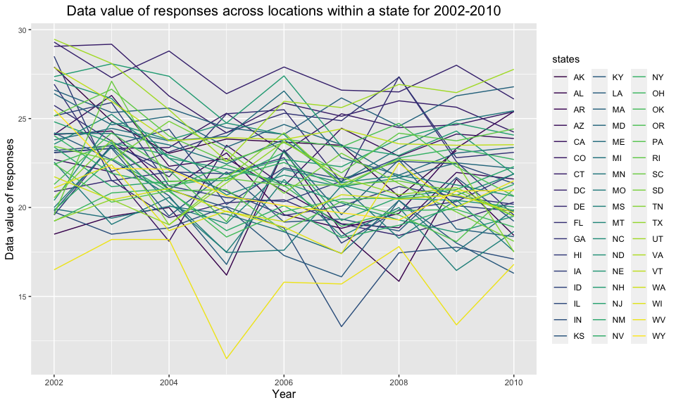
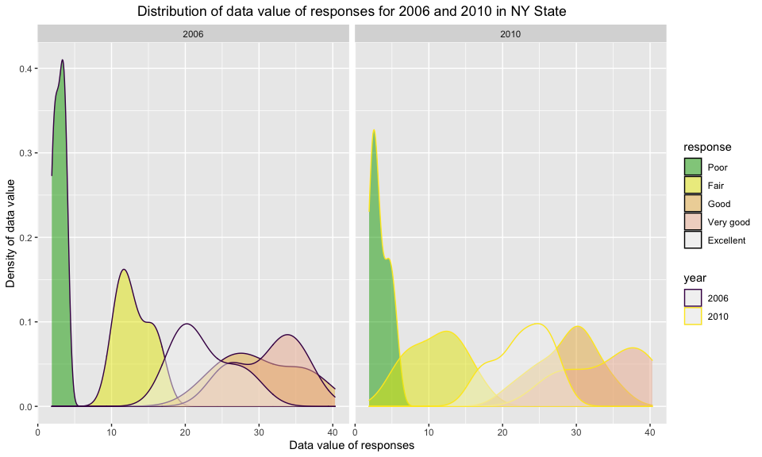

p8105_hw3_wb2366
================

``` r
library(tidyverse)
```

    ## ── Attaching packages ─────────────────────────────────────── tidyverse 1.3.1 ──

    ## ✓ ggplot2 3.3.5     ✓ purrr   0.3.4
    ## ✓ tibble  3.1.4     ✓ dplyr   1.0.7
    ## ✓ tidyr   1.1.3     ✓ stringr 1.4.0
    ## ✓ readr   2.0.1     ✓ forcats 0.5.1

    ## ── Conflicts ────────────────────────────────────────── tidyverse_conflicts() ──
    ## x dplyr::filter() masks stats::filter()
    ## x dplyr::lag()    masks stats::lag()

``` r
library(ggplot2)
```

## Problem1

**Load the data**

``` r
library(p8105.datasets)
data("instacart")
```

**How many aisles are there, and which aisles are the most items ordered
from?**

``` r
aisle_df = count(instacart, aisle) %>%
  arrange(desc(n))
```

**Answer:** According to the result of the chunk above, there are
**134** different aisles while **fresh vegetables** are the most items
ordered from.

**Make a plot that shows the number of items ordered in each aisle,
limiting this to aisles with more than 10000 items ordered. Arrange
aisles sensibly, and organize your plot so others can read it.**

``` r
filter(aisle_df, n > 10000) %>%
  mutate(aisle = fct_reorder(aisle, n)) %>%
  ggplot(aes(x = aisle, y = n)) +
    geom_col(width = .7,
             position = position_dodge(width = 0.9)) +
    labs(title = "The number of items ordered in each aisle",
         x = "Aisle",
         y = "The number of items") +
    theme(plot.title = element_text(hjust = 0.5, size = 15),
          axis.title.x = element_text(size = 12),
          axis.title.y = element_text(size = 12),
          axis.text.y = element_text(size = 8)) +
    coord_flip()
```

<!-- -->

**Make a table showing the three most popular items in each of the
aisles “baking ingredients”, “dog food care”, and “packaged vegetables
fruits”. Include the number of times each item is ordered in your
table.**

``` r
popular_bak_df = filter(instacart, aisle == "baking ingredients") %>%
  select(aisle, product_name) %>%
  group_by(aisle, product_name) %>%
  tally() %>%
  arrange(desc(n)) %>%
  head(3)

popular_dog_df = filter(instacart, aisle == "dog food care") %>%
  select(aisle, product_name) %>%
  group_by(aisle, product_name) %>%
  tally() %>%
  arrange(desc(n)) %>%
  head(3)

popular_pack_df = filter(instacart, aisle == "packaged vegetables fruits") %>%
  select(aisle, product_name) %>%
  group_by(aisle, product_name) %>%
  tally() %>%
  arrange(desc(n)) %>%
  head(3)

popular_item_df = rbind(popular_pack_df, popular_bak_df, popular_dog_df)

knitr::kable(popular_item_df,
             caption = "The three most popular items in each of the aisles")
```

| aisle                      | product_name                                  |    n |
|:---------------------------|:----------------------------------------------|-----:|
| packaged vegetables fruits | Organic Baby Spinach                          | 9784 |
| packaged vegetables fruits | Organic Raspberries                           | 5546 |
| packaged vegetables fruits | Organic Blueberries                           | 4966 |
| baking ingredients         | Light Brown Sugar                             |  499 |
| baking ingredients         | Pure Baking Soda                              |  387 |
| baking ingredients         | Cane Sugar                                    |  336 |
| dog food care              | Snack Sticks Chicken & Rice Recipe Dog Treats |   30 |
| dog food care              | Organix Chicken & Brown Rice Recipe           |   28 |
| dog food care              | Small Dog Biscuits                            |   26 |

The three most popular items in each of the aisles

**Make a table showing the mean hour of the day at which Pink Lady
Apples and Coffee Ice Cream are ordered on each day of the week; format
this table for human readers (i.e. produce a 2 x 7 table).**

``` r
week_mean_df = instacart %>%
  filter(product_name %in% c("Pink Lady Apples", "Coffee Ice Cream")) %>%
  select(order_dow, order_hour_of_day, product_name) %>%
  group_by(product_name, order_dow) %>% 
  summarize(mean = round(mean(order_hour_of_day), digits = 2), .groups = "drop") %>%
  mutate(
    order_dow = case_when(
      order_dow == 1 ~ "Monday",
      order_dow == 2 ~ "Tuesday",
      order_dow == 3 ~ "Wednesday",
      order_dow == 4 ~ "Thursday",
      order_dow == 5 ~ "Friday",
      order_dow == 6 ~ "Saturday",
      order_dow == 0 ~ "Sunday",
    )
  ) %>%
  pivot_wider(names_from = order_dow,
              values_from = mean)

knitr::kable(week_mean_df,
             caption = "The mean hour of the day at which Pink Lady Apples and Coffee Ice Cream are ordered")
```

| product_name     | Sunday | Monday | Tuesday | Wednesday | Thursday | Friday | Saturday |
|:-----------------|-------:|-------:|--------:|----------:|---------:|-------:|---------:|
| Coffee Ice Cream |  13.77 |  14.32 |   15.38 |     15.32 |    15.22 |  12.26 |    13.83 |
| Pink Lady Apples |  13.44 |  11.36 |   11.70 |     14.25 |    11.55 |  12.78 |    11.94 |

The mean hour of the day at which Pink Lady Apples and Coffee Ice Cream
are ordered

## Problem2

**Load the data,do some data cleaning**

``` r
library(p8105.datasets)
data("brfss_smart2010")
brfss_smart2010 = janitor::clean_names(brfss_smart2010) %>% 
  filter(topic == "Overall Health") %>% 
  mutate(response = fct_relevel(response, c("Poor", "Fair", "Good", "Very good", "Excellent"))) %>%
  arrange(response)
  pull(brfss_smart2010, response) %>% 
  unique()
```

    ## [1] Poor      Fair      Good      Very good Excellent
    ## Levels: Poor Fair Good Very good Excellent

**In 2002, which states were observed at 7 or more locations? What about
in 2010?**

``` r
brfss_location2002 = filter(brfss_smart2010,year == "2002") %>% 
  select(c(1,2,3)) %>% 
  distinct() %>% 
  count(locationabbr) %>% 
  filter(n > 7)

brfss_location2010 = filter(brfss_smart2010,year == "2010") %>% 
  select(c(1,2,3)) %>% 
  distinct() %>% 
  count(locationabbr) %>% 
  filter(n > 7)
```

**Answer:** According to the result of chunk above, the **3** states
**(NJ MA PA)** were observed at 7 or more locations in 2002, while the
**11** states **(CA FL MA MD NC NE NJ NY OH TX WA)** were observed at 7
or more locations in 2010.

**Construct a dataset that is limited to Excellent responses, and
contains, year, state, and a variable that averages the data_value
across locations within a state.Make a “spaghetti” plot of this average
value over time within a state **

``` r
brfss_Excellent_df = filter(brfss_smart2010, response == "Excellent") %>%
  drop_na(data_value) %>% 
  select(year, locationabbr, data_value) %>%
  group_by(year, locationabbr) %>%
  mutate(data_value = as.numeric(data_value)) %>%
  summarize(
    mean_data_vaule = round(mean(data_value), digits = 2),
    .groups = "drop")

ggplot(data = brfss_Excellent_df, aes(x = year, y = mean_data_vaule, color = locationabbr)) + 
  geom_line(aes(group = locationabbr)) +    
  labs(title = "Data value of responses across locations within a state for 2002-2010",
       x = "Year",
       y = "Data value of responses") +
  theme(plot.title = element_text(hjust = 0.5))
```

<!-- -->

**Make a two-panel plot showing, for the years 2006, and 2010,
distribution of data_value for responses (“Poor” to “Excellent”) among
locations in NY State.**

``` r
NY_2006_2010 = brfss_smart2010 %>%
  filter(year %in% c(2006, 2010),
         locationabbr == "NY") %>%
  select(year, locationabbr, response, data_value) %>%
  mutate(data_value = as.numeric(data_value),
         year = as.character(year)) 

ggplot(NY_2006_2010, aes(x = data_value, color = year)) +
  geom_density() +
  facet_grid(. ~ year) +
  labs(title = "Distribution of data value of responses for 2006 and 2010 in NY State",
       x = "Data value of responses",
       y = "Density of data value") +
  theme(plot.title = element_text(hjust = 0.5))
```

<!-- -->

## Problem3

**Load, tidy, and otherwise wrangle the data.**

``` r
Accelerometer_data = read_csv("./data/accel_data.csv",
                              col_types = cols()) %>%
  janitor::clean_names() %>%
  mutate(
    weekday_weekend = case_when(
      day == "Monday" ~ "weekday",
      day == "Tuesday" ~ "weekday",
      day == "Wednesday" ~ "weekday",
      day == "Thursday" ~ "weekday",
      day == "Friday" ~ "weekday",
      day == "Saturday" ~ "weekend",
      day == "Sunday" ~ "weekend",
    )
  ) %>% 
  relocate(weekday_weekend) %>% 
  pivot_longer(
    activity_1:activity_1440,
    names_to = "activity", 
    values_to = "activity_counts") %>% 
  relocate(week, day_id, day)
```

**Answer:** -Describe the resulting dataset: -It contains `50400`
observations with `6` variables which are respectively
`week, day_id, day, weekday_weekend, activity, activity_counts`.
-`week`: week for accelerometer data collected on a 63 year-old male
-`day_id`: day identifier -`day`: day of the week -`weekday_weekend`:
whether weekday or weekend -`activity`: activity identifier for
accelerometer data in the day -`acitvity_counts`: numeric value for
accelerometer data

**Traditional analyses of accelerometer data focus on the total activity
over the day. Using your tidied dataset, aggregate accross minutes to
create a total activity variable for each day, and create a table
showing these totals. Are any trends apparent?**

``` r
Acc_data_total = Accelerometer_data %>%
  group_by(week, day_id, day, weekday_weekend) %>%
  summarize(activity_total = round(sum(activity_counts), digits = 2),
            .groups = "drop")

filter(Acc_data_total, weekday_weekend == "weekday") %>% 
  pull(activity_total) %>% 
  mean()
```

    ## [1] 406822.8

``` r
filter(Acc_data_total, weekday_weekend == "weekend") %>% 
  pull(activity_total) %>% 
  mean()
```

    ## [1] 328845

**Answer:** There is a tendency that the accelerometer monitoring data
in weekend is much lower than the data in weekday due to less physical
activity in weekend.
